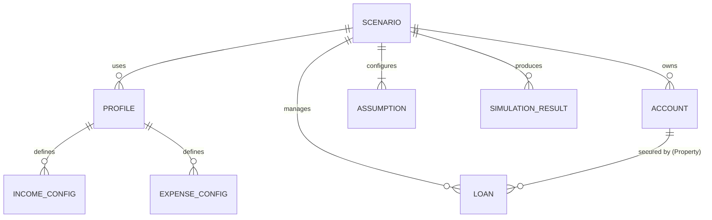

# BA Financial Analysis Application – Architecture Specification (v1.0)

**Date:** November 30th, 2025
**Version:** 1.0 (Final Baseline)

---

## 1. Executive Summary

### 1.1 Purpose
This document describes the end‑to‑end architecture for the **BA Financial Analysis** application, a client‑side financial planning tool that helps a household understand whether they can maintain their lifestyle and **avoid running out of money** over a multi‑decade horizon.

The architecture aligns with the **Requirements Specification v1.0** and is organized using a classic layered view:
- **Business Architecture** – personas, capabilities, rules, and value.
- **Data Architecture** – core entities, JSON structures, persistence, and lifecycle.
- **Application Architecture** – modules, services, and interactions.
- **Technology Architecture** – platform, tools, non‑functional design.

### 1.2 Scope
This specification covers:
- A single‑user, browser‑based web application (SPA style) with **local storage and JSON file** import/export.
- A **central financial projection engine** that runs entirely in the browser using a hybrid timebase (monthly/annual).
- A **modular UI** organized around core planning activities (Assumptions, Cash Flow, Liabilities, Assets, Dashboard).

It does **not** cover:
- Multi‑user synchronization or collaboration.
- Direct bank / brokerage integrations.
- Regulatory, taxation, or compliance sign‑off for use as a professional financial product.

### 1.3 Key Architectural Decisions
- **Client‑Only First:** All scenario data and calculations run locally in the browser. This minimizes privacy and hosting complexity.
- **Scenario‑Centric Model:** Everything is scoped to a **Scenario** object. Scenarios are serializable to and from JSON.
- **Unified Cash Flow Management:** Income and Expenses are managed in a single module to provide immediate "Net Flow" feedback.
- **System-Generated Liabilities:** The architecture explicitly supports "Virtual Liabilities" (e.g., Reverse Mortgage) that are created and managed by the engine, not the user.
- **Global Date & Time Navigation:** A **Time Machine** in the app shell controls the current model month/year and drives all visualizations.

### 1.4 Major Risks & Mitigations
- **Risk: Complexity Creep in the Engine**
  - *Mitigation:* Strict separation between **core engine logic** and configuration/rules. Unit tests enforce critical paths (e.g., 401k match logic, waterfall order).
- **Risk: Performance for Long Horizons**
  - *Mitigation:* Hybrid timebase (Monthly for 5 years, Annual for 30 years) reduces calculation steps while maintaining near-term precision.
- **Risk: Data Desynchronization**
  - *Mitigation:* All charts and tables derive from a single `runFinancialSimulation` output object, ensuring the Dashboard always matches the module views.

---

## 2. Business Architecture

### 2.1 Business Goals
- Enable a household to:
  - Understand **whether their assets, income, and home equity can support their lifestyle** over their planning horizon.
  - Explore **what‑if scenarios** across employment, housing, and spending decisions.
  - Avoid **running out of money** before expected end‑of‑life.
- Provide:
  - A **transparent model** where all assumptions are visible and editable.
  - A **shareable artifact** (Scenario JSON) for discussion.

### 2.2 Personas
- **Primary Planner (Owner)**: Creates and edits scenarios, maintains assumptions, explores what‑ifs.
- **Partner / Co‑Planner**: Reviews and adjusts a subset of inputs (e.g., FTE, retirement timing, discretionary spending).
- **Advisor / Reviewer**: Loads scenario JSON, clones/tweaks assumptions (conservative vs aggressive), and walks through outputs.

### 2.3 Business Capabilities
1. **Scenario‑Based Planning**: Define multiple independent scenarios. Clone, rename, and export/import.
2. **Cash Flow Management**:
   - **Income Modeling**: FTE trajectories, salary inflation, bonus timing, SS/Pension logic.
   - **Expense Modeling**: Recurring bills, housing costs, one-off events, and retirement "fun money" budgets.
3. **Liabilities Management**:
   - CRUD for Mortgages, HELOCs, and Personal Loans.
   - Automated visualization of the **System Reverse Mortgage**.
4. **Asset & Housing Planning**:
   - Liquid assets (Cash, Joint, 401k, IRA) with configurable growth and withdrawal rules.
   - Property modeling including appreciation phases and "New Construction" planning.
5. **Projection & Risk Detection**:
   - Generate time‑phased projections using a strict **Cash‑Flow Waterfall**.
   - Flag solvency risks (e.g., "Out of Money", "Forced Home Sale").

### 2.4 Business Rules (Highlights)
- **Investment Return Tapering (IARRA)**: Portfolio returns taper linearly from an Initial Rate (e.g., 7%) to a Terminal Rate (e.g., 3.5%) between ages 60 and 80.
- **Cash‑Flow Waterfall**: Deficits are covered in order:
  1. **Cash Savings** (down to `cashMin`).
  2. **Joint Investment** (down to `jointMin`).
  3. **Inherited IRA** (accelerated withdrawals).
  4. **401k / 403b** (down to `retirementMin`).
  5. **Reverse Mortgage** (if eligible and needed).
- **Reverse Mortgage Logic**:
  - Automatically triggered when liquid assets are depleted and 401k hits its safety floor.
  - Interest accrues monthly. Forced sale occurs if LTV exceeds age-based limits (40-60%).
- **Retirement Matching**:
  - **Brian**: Employer matches 50% of the first 6% of contributions.
  - **Andrea**: No employer match.

---

## 3. Data Architecture

### 3.1 Conceptual Data Model

**Core Entities:**
- **Scenario**: Top‑level entity containing all data for a single plan.
- **Profile**: Reusable configuration for Income or Expenses (time-phased).
- **Account**: Asset container (Cash, Joint, IRA, Retirement, Property).
- **Loan**: Liability container (Mortgage, Fixed, Revolving).
- **Assumption**: Global parameter (Inflation, Tax Tiers, Thresholds).
- **SimulationResult**: The calculated timeline containing snapshots of Net Worth, Cash Flow, and Events.

#### 3.1.1 Entity Relationship

*(Field names and structures are illustrative; implementation can adjust details while preserving intent.)*

### **3.2 Logical JSON Structure**

JSON

{
 "meta": {
  "version": "1.0",
  "activeScenarioId": "scen_default"
 },
 "scenarios": {
  "scen_default": {
   "id": "scen_default",
   "name": "Base Plan",
   "data": {
    "assumptions": {
     "inflation": { "general": 0.025, "medical": 0.05 },
     "thresholds": { "cashMin": 15000, "retirementMin": 300000 },
     "timing": { "startYear": 2026, "startMonth": 1 }
    },
    "income": {
     "brian": { "netSalary": 168000, "grossForContrib": 285000, "contribPercent": 0.10 },
     "andrea": { "netSalary": 105000, "grossForContrib": 173000, "contribPercent": 0.10 },
     "workStatus": { "2026": { "brian": 1.0, "andrea": 1.0 } },
     "profileSequence": []
    },
    "expenses": {
     "bills": [],
     "oneOffs": [ { "date": "2028-06", "amount": 25000, "name": "Wedding" } ],
     "retirementBrackets": { "65": 12000, "70": 10000 },
     "profileSequence": []
    },
    "assets": {
     "accounts": {
      "acct_1": { "type": "cash", "balance": 30000 },
      "acct_2": { "type": "property", "balance": 1500000, "inputs": { "linkedLoanIds": ["loan_1"] } }
     }
    },
    "loans": {
     "loan_1": {
      "type": "mortgage",
      "inputs": { "principal": 400000, "rate": 0.035 },
      "strategies": { "base": { "extraPayments": {} } }
     }
    }
   }
  }
 },
 "profiles": {
  "prof_1": { "type": "expenses", "data": { ... } }
 }
}

### **3.3 Data Persistence**

- **Storage:** localStorage key ba_financial_planner_v1.0.
- **Auto-Save:** Triggered on any state mutation.
- **Export/Import:** Full JSON export includes all Scenarios and linked Profiles. "Dev Export" includes the entire Store structure.

------

## **4. Application Architecture**

### **4.1 High‑Level Modules**

**App Shell**

- **Sidebar:** Navigation, Scenario Selector, Global Actions (Save/Export/Reset).
- **Time Machine:** Controls the simulationDate cursor.

**Core Views**

1. **Dashboard (Balance Sheet):**

- **Visualization:** Stacked Bar Chart (Assets vs Liabilities) + Net Worth Line.
- **Event Log:** Scrollable list of critical simulation events.

1. **Cash Flow Manager:**

- **Unified View:** Tabs for Income and Expenses.
- **Net Flow Chart:** Green/Red bar chart showing annual surplus/deficit.
- **Profile Manager:** Manages time-phased configuration sets.

1. **Liabilities Manager:**

- **CRUD:** Management of Fixed and Revolving loans.
- **System Integration:** Displays the "Virtual" Reverse Mortgage account when active.

1. **Assets & Property:**

- **Asset Cards:** Management of liquid and illiquid assets.
- **Property Planners:** Wizards for "New Construction" and "Home Purchase".
- **Global Rules:** Context-aware editing of engine thresholds (e.g., cashMin) directly on asset cards.

1. **Assumptions:** Global rates (Inflation, Market Returns) and tax configuration.

### **4.2 Financial Engine Service**

The **Financial Engine** (financial_engine.js) is a pure function that deterministically calculates the future state.

- **Inputs:** Active Scenario Data, Global Profiles.
- **Phases:**

1. **Pre-Calculation:** Amortizes loans, projects property values (Asset Math).
2. **Snapshot 0:** Calculates the "Day 0" Balance Sheet (Start Date).
3. **Monthly Simulation (Years 1-5):** High-resolution cash flow.
4. **Annual Simulation (Years 6-35):** Long-term projection.

- **Logic Handling:**

- **Future Assets:** Injects assets with future start dates as "Deposit Events".
- **401k Matching:** Applies specific match rules per person.
- **Deficit Waterfall:** Executes the withdrawal hierarchy.
- **Reverse Mortgage:** Tracks separate Interest/Principal buckets and enforces LTV limits.

- **Outputs:**

- timeline: Array of state snapshots for charting.
- events: List of significant occurrences.
- reverseMortgageDetails: Specific log for the Liabilities module.

### **4.3 Component Interaction Diagram**

Code snippet

flowchart LR
  subgraph UI[UI Layer]
    Shell[App Shell]
    Dash[Dashboard]
    CF[Cash Flow Mgr]
    Liab[Liabilities Mgr]
    Assets[Assets Mgr]
  end

  subgraph Store[Data Layer]
    Context[DataContext]
    LocalStorage[(Browser Storage)]
  end

  subgraph Logic[Domain Services]
    Engine[Financial Engine]
    LoanMath[Loan Math]
    AssetMath[Asset Math]
  end

  Shell --> Context
  Dash --> Engine
  CF --> Engine
  Liab --> LoanMath
  Liab --> Context
  Assets --> AssetMath
  Assets --> Engine
  
  Engine --> LoanMath
  Engine --> AssetMath
  
  Context <--> LocalStorage
  Context --> Engine

------

## **5. Technology Architecture**

### **5.1 Technology Stack**

- **Framework:** React 18+ (Vite).
- **Language:** JavaScript (ES6+) / JSX.
- **State Management:** React Context API + useReducer pattern.
- **Visualization:** Recharts (Responsive Container).
- **Styling:** Tailwind CSS.
- **Utilities:** date-fns (Date Math), lodash (Deep Cloning/Setting).

### **5.2 Non‑Functional Requirements**

- **Performance:** Simulation re-calc must occur in < 200ms to support real-time "slider" adjustments.
- **Precision:** Financial calculations use standard floating-point math; display logic handles rounding to nearest dollar.
- **Privacy:** Zero server-side data persistence; all data resides on the client device.

------

## **6. Future Roadmap**

- **Scenario Comparison:** Side-by-side visualization of two distinct scenarios (e.g., "Retire 65" vs "Retire 67").
- **Tax Modeling:** Implementation of progressive tax brackets and location-specific tax rules.

**Cloud Sync:** Optional encrypted backup to cloud storage (User Story 10).
