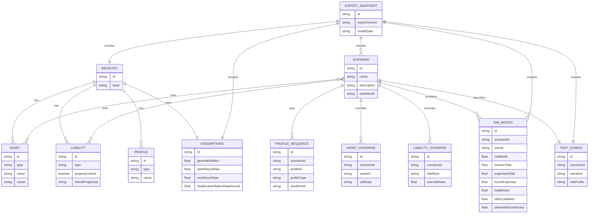

# BA Financial Analysis Application – Architecture Specification (v3.3.0)

**Date:** December 14, 2025  
**Version:** 3.3.0  
**Based on:** Architecture v1.4 :contentReference[oaicite:0]{index=0}  

---

## 1. Executive Summary

### 1.1 Purpose

This document describes the end-to-end architecture for the **BA Financial Analysis** application, a client-side financial planning tool that projects a household’s solvency and cash flow over a ~35-year horizon using a strict monthly engine.

### 1.2 Major Changes In v2.1 (vs. v1.4)

Building on the v1.4 architecture, v2.1 introduces:

- **Registry / Scenario Overlay Model**
  - Global **Registry** holds canonical Assets, Liabilities, Profiles.
  - **Scenarios** store only references + field-level overrides; runtime merge builds the effective view.

- **Enhanced Inherited IRA Logic**
  - Explicit 10-year RMD schedule stored on the asset.
  - **Planned January withdrawals** route net into Joint Investment.
  - **All other withdrawals** route net into Cash to avoid double taxation.

- **Property-Linked Liabilities & Housing Flows**
  - Any liability attached to a property is flagged as **property-linked**.
  - Debt service for property-linked liabilities is classified into **Home Expenses → Mortgage & Impounds**.
  - Voluntary scenario-driven property sales:
    - Payoff linked loans.
    - Net proceeds flow to **Cash**.
  - Forced sales (RM trigger) still direct proceeds to **Joint Investment**.

- **Tax Gross-Up for Property Funding**
  - When deposit / cash-to-close amounts are funded from tax-deferred or inherited accounts:
    - User specifies **net** target.
    - Engine gross-ups using effective withdrawal tax rate.
    - Event notes log gross, tax, and net.

- **Healthcare Modeling**
  - New **Healthcare** expense category on profiles (default 0).
  - Auto-generated **Healthcare Insurance** starting at age 65:
    - Baseline $5,000/year at age 65.
    - Grows with dedicated **healthcare inflation** assumption.

- **Monthly Burn View**
  - Scenario-level single-month **burn panel** with:
    - Recurring Bills & Living
    - Home Expenses (Mortgage, Impounds, HOA, Rent)
    - Healthcare
    - Other Liabilities
    - Planned Discretionary (one-offs + extra principal)
    - Total
  - Month selector is **Safari-safe** (`input[type="month"]` + `YYYY-MM` fallback).

- **AI-Ready Export Pipeline**
  - Export includes:
    - Full Registry.
    - Scenarios (links + overrides + profile sequences).
    - Assumptions (including healthcare inflation).
    - Month-by-month simulation.
    - A structured `textConfig` JSON block for AI analysis.

### 1.3 Major Changes In v2.3 (vs. v2.1/2.2)
- **Property-Centric Housing Costs**  
  - Property assets now carry impounds (tax/insurance) and other home costs (HOA/maintenance); mortgage costs flow from linked loans.  
  - Engine classifies property-linked loans into Home → Mortgage/Impounds and excludes them from “Other Liabilities.”
- **Cash Flow UX Overhaul**  
  - Cash Flow Manager now has tabs: Overview (burn summary + drilldown), Projections (chart + annual table), Expenses, Income.  
  - Planning Context bar (month, income/expense profile selectors, active property chips) with persisted selections per scenario.  
  - Monthly Burn shows split home breakdown (mortgage+impounds vs HOA/maintenance) and drill-to-edit links into accordion editors.
- **Projections Separation & Analysis**  
  - Net Cash Flow chart and annual analysis table live on the dedicated Projections tab; home columns split into mortgage+impounds vs HOA/maintenance in the table.
- **Import/Reset Hard Overwrite**  
  - All imports overwrite current app data after validation/migration; reset clears all known storage keys before seeding defaults. Missing scenario/profile prompts surfaced to the user.
- **Model Month Sync & Profile Persistence**  
  - Cashflow planning month mirrors the scenario model date; income/expense profile selections persist across navigation (stored under `ui.cashflow.selectedProfiles`).

---

## 2. Business Architecture

### 2.1 Core Capabilities

1. **Scenario-Based Planning**
   - Create and manage multiple scenario overlays (e.g., “Stay in SD”, “Paso Move”).
   - Each scenario:
     - Selects Assets/Liabilities from the Registry.
     - Applies overrides (sell dates, loan terms).
     - Links Income/Expense profiles with start dates.

2. **Unified Cash Flow Management**
   - Single Cash Flow Manager handles:
     - Work status & salary.
     - Social Security and pension.
     - Non-housing Expense Profiles (Recurring Bills & Living, Healthcare, discretionary, non-property debt).
   - Housing costs (mortgage & impounds, property tax, insurance, HOA, or rent) are derived from property and rent configuration, not from profiles.

3. **Advanced Housing Logic**
   - Model:
     - Primary residence (with property-linked mortgages).
     - New construction in Paso Robles or other locations.
     - Temporary housing (apartment rents).
   - Voluntary sales and new purchases:
     - Sale proceeds flow into Cash.
     - New mortgages automatically linked and classified as property-linked.
   - Reverse Mortgage phase and forced-sale behavior preserved from earlier versions. :contentReference[oaicite:1]{index=1}  

4. **Lifecycle Simulation**
   - Strict monthly simulation (420 steps):
     - Accumulation/decumulation.
     - Reverse Mortgage phase.
     - Forced liquidation / insolvency.

5. **Healthcare & Retirement Flows**
   - 10-year Inherited IRA schedule with differentiated routing for planned vs. ad-hoc withdrawals.
   - Post-65 Healthcare Insurance auto-expenses grown with a dedicated healthcare inflation parameter.

6. **AI-Ready Analytics**
   - One-click export:
     - Reloadable JSON snapshot.
     - Detailed month-by-month simulation.
     - `textConfig` JSON for AI consumption (scenario narrative, key events, risk parameters).

---

## 3. Data Architecture

### 3.1 Logical Data Model (v2.1)

**Top-Level Entities**

- **Registry**
  - Single global object containing canonical definitions:
    - `assets[]` – Properties, Cash, Joint Investment, 401k/IRA, Inherited IRA, etc.
    - `liabilities[]` – Mortgages, HELOCs, Reverse Mortgages, personal loans.
    - `profiles[]` – Income and Expense profiles (typed).
    - `assumptions` – Global economic and tax parameters.

- **Scenario**
  - References Registry items and stores:
    - `id`, `name`, `description`.
    - `startMonth` (YYYY-MM).
    - `linkedAssetIds[]`, `linkedLiabilityIds[]`.
    - `incomeProfileSequence[]`: `{ profileId, start }`.
    - `expenseProfileSequence[]`: `{ profileId, start }`.
    - `overrides`:
      - `assetOverrides` keyed by assetId:
        - e.g., `sellDate`, custom appreciation, etc.
      - `liabilityOverrides` keyed by liabilityId:
        - e.g., modified rate, extra principal.
      - `profileOverrides` as needed (low-usage).

- **SimulationTimeline**
  - Per scenario:
    - Array of monthly snapshots:
      - Per-account balances and flows.
      - Cash flow categories.
      - Net worth.
      - Notes.

- **ExportSnapshot**
  - A single JSON structure including:
    - `exportVersion`, `modelDate`.
    - `registry`, `scenarios`, `assumptions`, `timeline`, `textConfig`.

**Key Data Relationships**

- Asset ↔ Liability
  - Each liability may specify:
    - `propertyLinked: boolean`.
    - `linkedPropertyId` if property-linked; these liabilities’ payments are treated as Home Expenses (Mortgage & Impounds) in Monthly Burn.

- Profiles ↔ Liabilities
  - Expense Profiles describe non-housing spending.
  - Profiles may reference **non-property** liabilities for purposes of scheduling **extra payments** and categorizing non-property debt service, but they do **not** control whether property-linked loan minimum payments are made.

- Scenario ↔ Events
  - Each Scenario produces a sequence of structured **transition events** (property sales, purchases, Reverse Mortgage creation, phase changes, insolvency, etc.) that are included in `events[]` and in export snapshots.

### 3.2 Schema Additions In v2.1

1. **Registry Enhancements**
   - `asset.property`:
     - `purchasePlan` (existing from v1.4) for new construction / purchase flows. :contentReference[oaicite:3]{index=3}  
     - `sellDate` (Scenario override, not Registry field) to support voluntary sales.
   - `asset.inheritedIra`:
     - `rmdSchedule[]` – 10-year percentages (Year 1–10).
   - `liability`:
     - `propertyLinked: boolean`.
     - `linkedPropertyId: string | null`.

2. **Assumptions**
   - `healthcareInflationRateAnnual: number`.

3. **Profiles**
   - `type: "income" | "expense"`.
   - `healthcare: { ... }` category (may be simple numeric or structured by age bracket).
   - Optional metadata to indicate **source profile** when created via copy (for audit only).

4. **Scenarios**
   - `overrides.assetOverrides[assetId].sellDate` (YYYY-MM).
   - `overrides.assetOverrides[assetId].customAppreciation`, etc., as needed.

5. **Export**
   - `textConfig` JSON as part of the export schema:
     - `scenarioId`, `narrative`, `keyEvents[]`, `riskProfile`, `safetyFloors{}`.

### 3.3 Property Carrying Costs (v2.3)

- **Property asset schema**
  - `carryingCosts.impounds[]` (e.g., property tax, property insurance) stored on the asset; inflated using property-specific rates.
  - `carryingCosts.other[]` (e.g., HOA, maintenance/reserves) stored on the asset.
  - `linkedLoanIds[]` (or `linkedLoanId`) supplies mortgage/HELOC costs; those loans are marked property-linked.
- **Engine classification**
  - Property-linked loan payments → **Home: Mortgage + Impounds** bucket.
  - Impounds/other → **Home: Impounds** and **Home: HOA/Maintenance** buckets.
  - Non-property loans → **Other Liabilities**.
- **Ownership gating**
  - Carrying costs and linked loan payments apply only when the property is owned for the month (`startDate` ≤ month ≤ `sellDate`).
- **Profiles remain non-housing**
  - Expense profiles exclude property costs; housing is always derived from property assets.

### 3.4 Physical Data Storage

- **Client-Only Storage:**
  - Data persists in browser storage (e.g., `localStorage`).
  - Key pattern (current):  
    - `ba_financial_planner_v3.3.0_registry` (v3.3.0 keeps this label for compatibility).
  - Reset clears all known historical keys (v2.0–v3.3.0) before seeding defaults; imports hard-overwrite all stored data after validation/migration.

- **Import / Migration Logic:**
  - A **Data Integrity Engine** (introduced v1.4) continues to:
    - Validate incoming JSON (imports or version upgrades).
    - Add missing fields with defaults.
    - Map v1.4 schema (`scenario` with embedded objects) to v2.1 schema (`registry + scenario overlay`). :contentReference[oaicite:4]{index=4}  

---

## 4. Application Architecture

### 4.1 High-Level Modules

**App Shell**

- Sidebar:
  - Scenario selector (with delete guard: the last remaining scenario cannot be deleted).
  - Global actions:
    - Save (auto-save indicator).
    - Export.
    - Reset (clear back to Example Scenario / default state).
- Top Bar:
  - Scenario name, simulation period.
  - “Time Machine” controls (where applicable).
- UX Standard:
  - All configuration inputs and interactive controls surface inline help:
    - Tooltip text or helper copy sourced from shared field metadata.

**Core Functional Areas**

1. **Scenario Builder**
   - Multi-step wizard:
     1. Scenario name / description / start month.
     2. Balance Sheet selection from Registry.
     3. Income/Expense profile assignment (sequences).
     4. Visualization preview (basic chart before full dashboard).
   - Writes:
     - Scenario JSON (links + overrides) into Data Context.

2. **Dashboard**
   - Consumes `SimulationTimeline` to show:
     - Net worth trajectory.
     - Liquidity metrics.
     - Solvency year or “no insolvency” marker.
   - Uses Recharts for graphs.

3. **Cash Flow Manager (v3.3.0)**
   - Tabbed layout:
     - **Overview**: Monthly Burn summary (home split: mortgage+impounds vs HOA/maintenance), context chips, and drill-to-edit accordions for bills, living, liabilities, discretionary/one-offs.
     - **Projections**: Net Cash Flow chart + annual analysis table (home columns split).
     - **Expenses / Income**: Full profile editors with timeline manager.
   - Planning Context bar:
     - Month picker synced to model date, expense/income profile selectors (persisted per scenario), active property chips, quick “duplicate to profile.”
   - Profile persistence:
     - Selected profile IDs stored under `ui.cashflow.selectedProfiles`, surviving navigation.
   - Housing treatment:
     - Property-linked loans excluded from “Other Liabilities”; property carrying costs pulled from Assets (impounds/HOA/maintenance) and applied when owned.

4. **Assets & Property Planner**
   - Asset list and detailed editor for:
     - Liquid assets, retirement accounts, Inherited IRA.
     - Properties (primary, investment, new construction).
   - New Construction / Purchase:
     - Closing cost worksheet.
     - Funding source selector with dynamic balance preview.
     - Auto loan sizing and creation of property-linked liabilities.

5. **Liabilities Manager**
   - Table/editor for:
     - Mortgages, HELOCs, Reverse Mortgages, plan loans, and other liabilities.
   - Flags property-linked loans and shows their associated property; these payments are always classified into “Home Expenses (Mortgage & Impounds)” in Monthly Burn.
   - Allows extra principal payment schedules and re-amortization:
     - Extra payments are **in addition to** the minimum planned payment; they do **not** override or replace minimums.

6. **Assumptions**
   - Editor for:
     - General inflation, returns, tapering rules.
     - Tax rate assumptions (effective withdrawal rates).
     - Healthcare inflation parameter.
   - Preview of derived parameters (e.g., age-based return curve).

7. **Export / AI Integration**
   - “Export to JSON” action:
     - Triggers snapshot generation:
       - Registry.
       - Scenarios.
       - Assumptions.
       - SimulationTimeline.
       - `textConfig`.
   - “Import” action:
     - Validates JSON (Data Integrity Engine).
     - Reconstructs Registry + Scenarios, then re-runs simulation.
     - **Hard overwrite** of all stored data (no merge); missing scenarios/profiles prompt user resolution.

### 4.2 Component Interaction

**DataContext**

- Central React Context that:
  - Owns:
    - `registry`, `scenarios`, `activeScenarioId`, `assumptions`.
  - Handles initialization:
    - On first run (no stored data), seeds a default Registry plus an **Example Scenario** so the app never opens in an empty state.
  - Exposes actions:
    - `createScenario`, `updateScenario`, `deleteScenario` (enforces “cannot delete last scenario”), `copyProfile`, `updateAsset`, `updateLiability`, `updateAssumptions`, etc.
    - `runSimulation(activeScenarioId)` which:
      - Calls the Financial Engine with:
        - Resolved scenario (merge Registry + overrides).
        - Assumptions.

**Financial Engine**

- Pure-domain service (`financial_engine.js` or equivalent) that:
  - Accepts:
    - `registry`, `scenario`, `assumptions`.
  - Returns:
    - `simulationTimeline`.
    - `events` (forced sale, insolvency, etc.).

**UI to Engine Flow**

- Editing any financial input marks Scenario/Registry as “dirty”.
- On commit (blur / Apply button):
  1. DataContext updates local state.
  2. Triggers `runSimulation`.
  3. `simulationTimeline` is stored and fed to:
     - Dashboard.
     - Monthly Burn view.
     - Ledger.

### 4.3 Architectural Diagram

## 5. Financial Engine Architecture

### 5.1 Inputs & Outputs

**Inputs**

- `registry` – Global definitions.
- `scenario` – Links + overrides for the active scenario.
- `assumptions` – Parameters (inflation, returns, tax, healthcare).

Before entering the loop, the engine:

1. Resolves:
   - Assets = Registry assets filtered by scenario links, plus overrides.
   - Liabilities = same.
   - Profiles = Income/Expense with scenario profile sequences.
2. Computes:
   - Age timeline for primary/spouse.
   - Derived parameters (tapered returns, healthcare insurance schedule).

**Outputs**

- `timeline[]` – 420 month snapshots.
- `events[]` – Key events (retirement, RM start, forced sale, insolvency).
- Derived aggregates:
  - Net worth series.
  - Category breakdowns per month.

### 5.2 Monthly Simulation Loop

For month `t`:

1. **Initialize State**
   - Load previous month’s balances.
   - Determine active Income Profile and Expense Profile from scenario profile sequences.
   - Determine which assets/liabilities are active (e.g., property sold flags, RM presence).
   - Resolve housing context (owned primary vs rent) for this month.

2. **Growth / Appreciation**
   - Apply investment returns via `AssetMath` for all investment accounts.
   - Apply property appreciation **at the start of the month** so that any sale in `t` uses the updated value.

3. **Stateless Inflation Adjustments**
   - For all quantities subject to inflation (e.g., non-housing profile expenses, property taxes and insurance, rent, Healthcare Insurance):
     - Compute `monthsSinceBase` from a global base month.
     - Apply:
       - `inflatedAmount = baseAmount × (1 + annualInflation)^(monthsSinceBase/12)`.
   - This keeps inflation **stateless**: values depend only on calendar time, not on simulation order.

4. **Income**
   - From the active Income Profile:
     - Compute FTE-weighted salary and bonuses.
     - Compute PIA-based Social Security and pensions per their start ages.
   - Employment income is modeled as **net take-home**.
   - Pension / SS inflows are modeled as **gross** and taxed via age-based effective rate tables.

5. **Non-Housing Expenses**
   - From the active Expense Profile (non-housing only), compute:
     - Recurring Bills & Living.
     - Profile-defined Healthcare (non-insurance).
     - Non-property liability-related expenses (if modeled in the profile).
   - Apply profile-specific inflation settings.

6. **Housing Costs**
   - If an owned primary property is active:
     - Compute Home Expenses as:
       - Property-linked loan debt service (principal + interest + escrow).
       - Property tax.
       - Property insurance.
       - HOA dues.
   - If no primary property is active:
     - Compute Home Expenses from Scenario rent configuration (rent + rent-specific fees).

7. **Healthcare Insurance (Auto)**
   - If Primary’s age ≥ 65:
     - Use `healthcareInflationRateAnnual` to maintain the annual Healthcare Insurance baseline.
     - Allocate 1/12 of that year’s Healthcare Insurance to this month.
   - Add this on top of any profile-defined Healthcare category amount.

8. **Debt Service**
   - For each liability:
     - Use `LoanMath` to compute the **minimum planned payment** (amortized or revolving).
   - Apply classification:
     - Property-linked liabilities → Home Expenses.
     - Non-property liabilities → Other Liabilities.
   - Apply any **extra principal payments** scheduled in Expense Profiles:
     - `totalPayment = minimumPayment + extraPayment`.
     - Extra payments never override the minimum planned payment.

9. **Planned Discretionary**
   - Sum all one-off discretionary events scheduled for month `t` (vacations, major purchases, etc.).
   - Include extra principal payments here in the Monthly Burn view’s **Planned Discretionary** bucket.

10. **Net Cash Flow & Phase-Aware Waterfall**
    - Compute:
      - `totalIncome`.
      - `totalExpenses` including:
        - Non-housing expenses.
        - Home Expenses.
        - Healthcare (profile + auto insurance).
        - Other Liabilities.
        - Planned Discretionary.
        - Taxes.
    - `netFlow = totalIncome − totalExpenses`.
    - If `netFlow > 0` (surplus):
      - Apply surplus allocation rules (e.g., refill Cash to targets, then Joint Investment).
    - If `netFlow < 0` (deficit):
      - Apply deficit waterfall according to the current lifecycle phase:
        - Phase 1: Cash → Joint → Inherited IRA → 401k/403b.
        - Phase 2: Reverse Mortgage / R-HELOC draws subject to LTV.
        - Phase 3: Spend-down of remaining assets (Joint → 401k/403b → Cash), potentially entering insolvency.

11. **Discrete Events**
    - Evaluate and execute discrete events in this month:
      - **Inherited IRA 10-Year Planned Withdrawals:**
        - If month is January of a scheduled year:
          - Use `TaxSvc` to compute gross withdrawal.
          - Net proceeds → **Joint Investment** (planned 10-year schedule).
      - **Ad-Hoc Inherited IRA Withdrawals:**
        - When needed for deficits or explicit funding events (e.g., down payments):
          - Use `TaxSvc` to compute gross withdrawal.
          - Net proceeds → **Cash**.
      - **Property Planner Events:**
        - Contract/close funding using configured funding sources.
        - Apply tax gross-ups when pulling from tax-deferred or Inherited accounts.
        - Create new property-linked loans at closing.
      - **Voluntary Property Sale (Scenario Sell Date):**
        - When current month equals a property’s `sellDate`:
          - Sell at current (already-appreciated) value.
          - Pay off all property-linked liabilities.
          - Apply transaction costs.
          - Net proceeds → **Cash**.
          - Update housing context (switch to another primary property or to rent).
      - **Reverse Mortgage / Forced Sale Events:**
        - When Reverse Mortgage (R-HELOC) is created (Phase 2 trigger).
        - When R-HELOC LTV breach occurs:
          - Forced sale logic.
          - Net proceeds → **Joint Investment**.
          - Mark Scenario as in final spend-down phase.

12. **Record & Emit Events**
    - Update:
      - Balances for all accounts and liabilities.
      - Category totals:
        - Recurring Bills & Living.
        - Home Expenses (Mortgage & Impounds & HOA & Rent).
        - Healthcare.
        - Other Liabilities.
        - Planned Discretionary.
        - Taxes.
        - Net Savings / Drawdown.
    - Append one or more structured **events** for this month (if any occurred) to the Scenario’s `events[]` collection.
    - Construct a human-readable **Note** summarizing key drivers and any gross-up or major housing transitions.

### 5.3 Monthly Burn Aggregation

The Monthly Burn view is not a separate engine; it consumes `timeline[t]` and assembles:

- **Category Totals:**
  - Recurring Bills & Living.
  - Home Expenses (Mortgage & Impounds & HOA & Rent).
  - Healthcare.
  - Other Liabilities.
  - Planned Discretionary.
- **Context Metadata:**
  - Active profiles.
  - Active primary residence status.

This is implemented as a straightforward selector and aggregator in the UI layer using the engine’s output.

------

## 6. Technology Architecture

### 6.1 Stack

- **Frontend Framework:** React 18+ (e.g., Vite bundler). ba_financial_analysis__architec…
- **Language:** JavaScript (ES6+) / JSX.
- **State Management:** React Context + `useReducer`.
- **Charts:** Recharts.
- **Styling:** Tailwind CSS.
- **Utilities:** `date-fns`, `lodash`.

### 6.2 Key Technical Concerns

- **Performance**
  - Full 420-month simulation must complete in <200ms under typical conditions.
  - Registry + Scenario overlay avoids duplicating large structures in memory.
- **Precision**
  - Use standard JS number type; centralize rounding in display layer (nearest dollar) to avoid rounding drift.
- **Cross-Browser UX**
  - Month picker:
    - Use `input[type="month"]` where available.
    - Fallback to `YYYY-MM` manual input in Safari with client-side validation.
- **Security & Privacy**
  - No server-side persistence.
  - All data is stored locally unless user explicitly exports JSON.

------

## 7. Roadmap (Post-v2.1 Ideas)

- **Scenario Comparison Dashboard**
  - Side-by-side view of two scenarios’ Monthly Burn and net worth trajectories.
- **More Detailed Tax Modeling**
  - Progressive tax brackets.
  - Location-based tax rules.
- **Cloud Sync (Opt-In)**
  - Encrypted remote storage for Registry + Scenarios, retaining current client-side architecture as default.
- **Cash Sweep Rule**
  - Reintroduce an excess-cash sweep that automatically moves surplus cash above a user-defined floor into the joint investment account each month.
